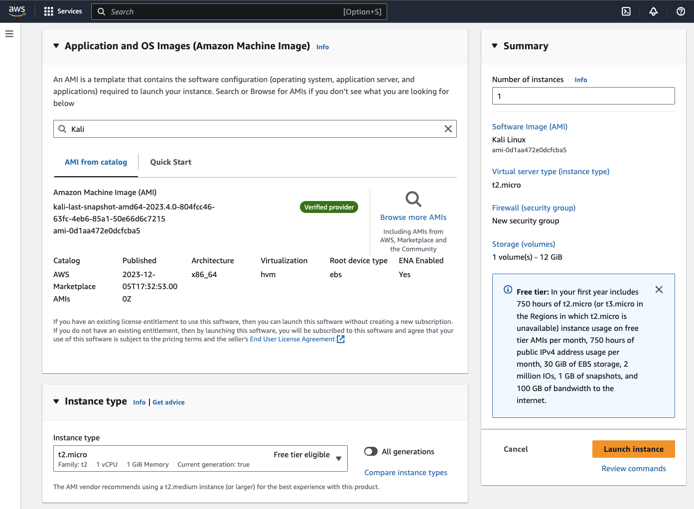

# Ethical Hacking Using the Cloud

## Installing Kali Linux on AWS

The first operating system that we're going to install is Kali Linux.

See, throughout the course we're going to use a number of hacking tools.
You can install each of these tools manually.

Or you can do what most hackers do, including myself, and save time and effort 
and use an operating system designed for hacking.

We're going to use an operating system called Kali Linux. It's a Linux distro 
based on Debian, and the only difference between Kali and the actual original 
Debian Linux distro is the fact that Kali has a lot of hacking and penetration 
testing tools, pre-installed and pre-configured in it.

Therefore, once you install Kali, you will have access to so many hacking tools 
without the need to install or configure any of them, which will save you a lot 
of time and a lot of effort.

This is your home, your control panel to your Amazon Cloud account. So we're 
going to scroll down. And in here it's giving you a number of options to build 
a solution.

And the first one is to launch a virtual machine, which is what we want to do.
We want to start a Kali machine. So let's open this in a new tab.

And even though this looks pretty cluttered and it might seem complex, it's
actually very, very simple. Basically, first of all, it's asking you to give a 
name to this computer, to this virtual machine

that you're going to create, and let's call it Kali, because it's going to be a 
Kali machine. And if you scroll down, it's giving you the application or the OS, 
the operating system that you want to start.

So in here, it's giving you a nice slider that contains the most common 
operating systems that people usually use.

So you've got ubuntu, windows, Red hat, Mac OS and so on. Alternatively, you 
can click on Browse More AMIs.

Basically, an Ami is an Amazon Virtual machine, so you could use the search bar 
in here to search the marketplace for whatever virtual machine you want to start.

So you can see in the quick start we only have 44, but in the marketplace we 
got 5000 and 485 machines. So you could simply just in here type hacking and 
you'll get all the virtual machines that you could start that contain the word 
hacking in them.

You could read the description. You could even look up on Google what features 
these virtual machines have. But we want to run a Kali machine. So I'm just 
going to type Kali. And as you can see, we have a Kali machine in here.

You'll always see the latest current version in here. So we're just going to 
click on select. And as you can see it's saying it's eligible for the free tier.
So that's perfect. So we can go ahead with it.

We're going to click on continue. And we're back to the same page where we were 
selecting the operating system. But as you can see now, Kali Linux is selected 
for us. So once we finish this process, Amazon is going to create a Kali machine 
for us on their servers.

Now, if we scroll down, it's asking us for the instance type. So the machine 
type or the resources of the machine that we will install Kali on. So we can 
use the drop down to change that. And we want to make sure we go for the free 
one. So as you can see, we can go for this one and this one.

| Kali Linux Image on AWS |
| :---: |
|  |

These are the only two that are eligible for free. If you go for the others, 
you will be charged. So we're going to go with this one because it has the 
higher spec than this one. So it's going to come with one CPU and one gigabyte 
of memory. So not a lot of resources, but it should do for now.

Next, we'll have to create a key pair, which will be used to log in to this 
computer that we are creating on the cloud. So basically what we're doing is 
we're creating a Kali machine on Amazon's cloud servers. But we don't have 
physical access to this computer. It's at Amazon's servers.

Therefore for us to be able to use it, we're going to have to communicate with 
it using a service or using a tunnel that is called SSH. So SSH is a service 
that allows us to remotely control computers on the internet.

Now, obviously you can't control any computer you want. There has to be some 
kind of authentication between you and the server. And we do that using keys.
So we create a public key on the server and a private key that will be kept by 
you by the user. Now this private key serves like a password. So you should 
never share it with anybody.

And you're going to use it in order to authenticate with the server, with the 
computer that we're creating on the cloud. And it will only allow you to 
control it over SSH if your private key matches the public key.

So in here, it's asking us whether we want to use an existing key pair or if 
we want to create a new key pair. Now, I've never created one, so I'm going to 
click on create a new key pair. We're going to set a name for this key pair.

So we're just going to name it "Kali-keypair" key pair. We're going to keep the 
options in here the same. And we're going to click on create a key pair. So as 
you can see now Amazon automatically downloaded a file.

For me it's called Kali dash Keypair pem. And this is the private key which 
I'm going to use to authenticate with the server. And it automatically stored 
the public key in the server in the right location.

So I don't need to worry about this key. But later on, once the machine is 
created, I'm going to use the private key that I have in my downloads.
Right now it's called Kali Keypair PEM to authenticate and log in to my Kali 
machine that is stored on the cloud.

If you scroll down, it'll give you some network settings that you can modify, 
but we're going to leave everything the same in here. You could tick these boxes 
to allow connections to the web server, but I'm going to show you how to
do that later on anyway, so you don't need to take any of this.

Scrolling down, you're going to get to the storage configuration, where you 
could configure the amount of storage that your computer is going to have.
You could also set advanced settings in here, but we're going to leave that 
for now. You could also see a summary of everything that we selected so far.

So we're creating a Kali Linux machine. This is the instance type. We selected 
this because it's the free one. It's not the most powerful but it's free.

You can see we have no firewall settings. We'll talk about that later. The 
amount of storage we have 12GB. Now we're actually eligible for 30. So I'm 
actually going to change that here to 30. But make sure you stick with whatever 
you're allowed for for the free tier if you don't want to spend anything.

And we're going to click on Launch Instance. So now Amazon is going to do 
everything automatically for you. It's going to create a new computer on their 
cloud servers, install the latest Kali on it and install the public key on it.

So then you can log in to that computer using SSH using the private key that we 
just downloaded in here. And I'm going to show you how to do that in the next 
lecture. Now I'm getting another message similar to what I got when I was 
signing up with the verification problem. It was telling me it might take some 
time. It's saying that this machine is taking a little bit extra time than usual.

Give it some time. Try again in about half an hour or so. And then we're going 
to resume and continue. You can also click on the launch log to see where it's 
failing or where it's getting stuck. And we can see we're getting stuck at the 
subscription marketplace. But anyway, I gave it some time.

So I'm going to click on View All Instances in here to see if my instance is 
ready. And as you can see, my Kali machine right now is actually running.
And I can actually go ahead and connect to it and use it. And I'm going to show 
you how to do that in the next lecture. If you ever wanted to come back to this 
page where you can see your machines after you log in, all you have to do is 
simply click on services and click on EC2.

Amazon has a number of categories for their cloud services, and the Kali machine 
that we created falls under the EC2 category. Therefore, all you have to do is 
click in here and you will end up in this page where you can see it and manage it.
